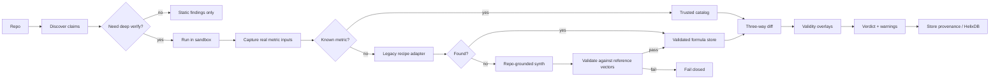

# Calma — repo-processing pipeline & the cost model

How a repo becomes verified numbers, designed so **cost-per-scan stays low even on repos with thousands of
claims.** This answers the "won't this be 1000s of Exa calls?" worry head-on.

## Architecture At A Glance



The important design rule is: **Exa is a fallback for the novel tail, not the default path**.

## The reframe: two orthogonal problems (don't conflate them)

The two options on the table each solve a *different* problem:

| Problem | What it needs | Cost shape |
|---|---|---|
| **Make-runnable** — get the repo to execute | deps + run-plan ("Option B": an LLM writes a requirements.txt) | **once per repo**, cached per *stack* |
| **Formula resolution** — the trusted recompute math | the metric's definition + a validated implementation ("Option A": Exa-find the formula) | **once per distinct novel metric**, cached **globally** |

They have different cost profiles and different caches. Treating "every calculation → Exa" as one thing is
the cost trap. Keep them separate.

## The crux: **claims ≠ formulas**

A repo with "1000s of formulas" almost never has 1000s of distinct *metric types*. Your `gb_kmer_benchmark`
reports ~thousands of rows, but they're **3 metrics** (accuracy, AUROC, MCC) × many datasets × models × k.

- **Formula resolution is per-distinct-metric, not per-claim.** Dedupe first → resolve ~3 formulas, not 3000.
- **Recompute is pure arithmetic → free per claim.** 3000 claims recompute from 3 formulas instantly.
- So **cost scales with `distinct novel metrics × novel stacks`, not with claims.** The flywheels drive that
  toward zero.

## The cost-optimal pipeline (recommended — synthesizes A + B + the key saver)

```
1. DISCOVER + DEDUPE         claims → the set of DISTINCT metrics (cheap; static)
2. CLASSIFY (the key saver)  each distinct metric → catalog / recipes(626) / Helix?   ← ~95% land here, $0
                             only genuinely-novel survives to step 4
3. MAKE-RUNNABLE             env files present → use them; else ONE agent session writes
   (Option B, cached)        requirements.txt + run-plan (Repo2Run; 86% on Python repos).
                             cache by stack signature → reproduction flywheel ($0 next time)
4. RESOLVE NOVEL FORMULA     Helix vector lookup (seen before? → reuse, $0)
   (Option A, gated)         → else repo-local definition / tests / fingerprints / aliases
                             → only then Exa for the truly missing tail
                             → LLM synthesizes code → VALIDATE vs golden vectors → bank in Helix
5. CAPTURE / RECOMPUTE       committed predictions → recompute directly (no re-run);
                             else re-run + capture. Recompute ALL claims (free). Three-way diff.
```

### Why this is cheap

- **Step 2 is the lever.** Most "custom" metric code is a *reimplemented standard* (`def accuracy(...)`
  instead of sklearn). One cheap LLM **classify** call ("is this a known metric?") maps it to the catalog →
  **no Exa.** Exa is reserved for a *genuinely new* metric (a novel formula from a paper).
- **Exa fires once per distinct novel metric, ever** — then it's a `Formula` node in Helix, reused by every
  future repo (global cache). Per-repo Exa cost ≈ (novel metrics) × ~$0.005 → ~$0 as the catalog graph grows.
- **Make-runnable is one agent session per repo**, cached per stack. Feed it just the import graph + README
  (not the whole repo) to keep tokens minimal.
- The genuinely expensive bit is **sandbox execution** (re-running the code) — metered as sandbox-minutes in
  the pricing model — not the formulas.

## Formula acquisition — the cost ladder (Exa is the fallback, not the default)

The worry "Exa-search a formula for every claim" assumes the *source* of the formula must be a web search.
It doesn't — and **trust comes from validation, not from the source**, so always take the cheapest source:

1. **Catalog + 626 recipes** — free. Covers the overwhelming majority of real metrics.
2. **Alias / dedupe / fingerprints** — free. Most “new” names are rebrands of a known metric, or repeated
   calls to the same metric under different splits.
3. **The LLM already knows it** — ~1 cheap call, no web search. A model knows MCC/Brier/NDCG/Sortino/… and
   writes the implementation from its own weights. The workhorse for the long tail — *not* Exa.
4. **The repo defines it** — free. A genuinely-novel metric is often defined in the cloned repo (function +
   docstring/paper). Extract the definition locally, re-implement independently.
5. **The repo's tests** — free golden vectors to validate the implementation (`assert metric(x)==y`).
6. **Exa** — the rare fallback for a metric even the LLM doesn't know and the repo doesn't define. Banked in
   Helix once, globally — reused for $0 forever.

Plus two that need **no formula at all**:
- **Identity checks:** repo reports P, R, *and* F1 → check `F1 = 2PR/(P+R)` instead of looking F1 up.
- **Computation fingerprint:** recognize a metric from its captured dataflow when the name is unknown.

Per repo, after deduping to *distinct* metrics, formula resolution is ~$0 in the common case. Exa is the
tail, not the default. Meta-principle: **dedupe → cheapest source → validate independently → bank once**.

## On the two options you floated

- **Option A (Exa every calculation):** right idea, wrong scope. Gate it behind catalog→recipes→Helix
  (steps 2 + 4). Exa only for the novel tail. The router already does this (`recompute_any`); the addition
  is the **classify-before-Exa** step plus repo-grounded synthesis before web search.
- **Option B (LLM writes its own requirements.txt):** yes — this is make-runnable (step 3) for repos without
  env files. Your genomic repo *has* `requirements.txt`, so it's used directly; the agent only writes one
  when the repo lacks it. Cache it.

## A third idea worth taking: **ground from the repo, validate independently**

For a novel metric, the repo usually *defines* it (in code + the paper/README). So:
- **Ground the synthesis from the repo's own definition** (already cloned, free) — Exa is the *fallback* when
  the repo doesn't document it.
- But **validate independently** (golden vectors from the definition, or the repo's own published test
  vectors) — never trust the repo's implementation, since that's what's under test. This preserves the
  blackbox/anti-circularity guarantee while cutting Exa further.

## Where HelixDB (graph + vector) fits

Helix is the right store because the catalog is a *graph with semantic dedup*:
- **`Formula` nodes** (validated recompute code) + **alias edges** + **derived-from edges** → the catalog
  knowledge graph; **vector search dedups paraphrased metrics** ("MCC" ≈ "Matthews correlation" ≈ "phi") →
  near-zero re-synthesis.
- **`RunPlan` nodes** keyed by stack signature → the reproduction-flywheel cache (env reuse).
- **`Repo → metric → formula` edges** → provenance + the proprietary verification corpus (a moat that also
  visualizes as a graph).

A live instance is running (`helix start dev`, port 6969); formulas persist as graph nodes today.

## The one-line cost answer

> Verifying 1000s of claims costs ~the same as verifying the **handful of distinct metrics** behind them,
> because formulas are resolved once (catalog-first, Exa only for the novel tail) and banked in Helix
> forever, while recompute is free. The real meter is **sandbox-minutes**, which the pricing model already
> bills. The flywheels make month-N cheaper than month-1.
